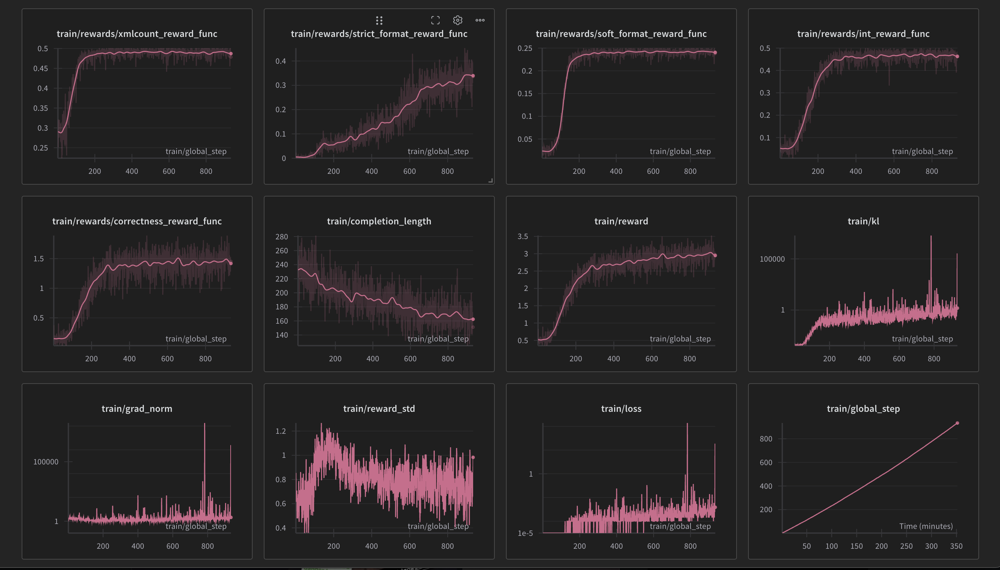

# Training an R1-style Large Language Model using GRPO w/ Axolotl

In this example, we will demonstrate how to train Qwen 2.5 1.5B Instruct to reason using R1-style post-training with 
the GRPO technique.

## Installation

To get started you'll need to install vllm==0.7.2 and both trl and axolotl from source as GRPO support is still in flux.

```bash
pip install --no-build-isolation "axolotl[vllm] @ git+https://github.com/axolotl-ai-cloud/axolotl.git@grpo"
pip uninstall trl
pip install --no-deps "trl @ git+https://github.com/huggingface/trl.git@main"
```

## Knowing your dataset

For this, we're using the GSM8K dataset which has been a popular choice for experimentation for R1-style learning by 
the community. Using the provided `stats.py`, we first analyze the dataset to determine the maximum tokenized length
of the  system prompt + question. We find that for the Qwen 2.5 tokenizer, the maximum combined input length is 263. 
For Llama 3.x series, this is 266. By combining this with the constraint that we only want the model to generate up to
512 tokens, we can set our sequence length to ~800.

## Reward functions

There has already been quite a lot of experimentation in the AI/ML community with the GSM8K dataset, so we're going to
use some existing reward functions that have shown promise by 
[@willccbb](https://gist.github.com/willccbb/4676755236bb08cab5f4e54a0475d6fb). We've corrected some of the logic in the
reward functions such as the loose formatting function.

1. `int_reward_func` - As all gsm8k answers should be only integers, this provides a small reward to push the model to only respond with integers. 
2. `correctness_reward_func` - This checks that the answer within the <answer></answer> tags is exactly the label.
3. `strict_format_reward_func` - This validates that the structure of the response exactly matches the prompt, inclusive of newlines.
4. `soft_format_reward_func` - This also checks the structure, but doesn't penalize the model if it doesn't match all the newlines exactly.
5. `xmlcount_reward_func` - This rewards the model to have exactly one of each of the xml tags in the structured response.

## GPU choice

With Qwen 1.5B, you'll need 2 GPUs. One for training and the other for inference with vLLM. For the gsm8k dataset with 
16x rollouts, these should fit on GPUs with ~48GB VRAM, so we chose 2xL40S. While we could have chosen to do 8x rollouts
in order to fit both the trainer and vLLM models on the same GPU, we opted to stick with 16x rollouts similar to the 
original paper.

## Training

For inference TRL loads vLLM onto the last GPU, so when we start the trainer, we need to tell accelerate to use `N - 1`
GPUs or processes for training, e.g. `--num-processes=1` in our case.

Putting it all together we have the `gsm8k_grpo.py` module providing the reward functions, and we've configured the 
hyperparameters in `gsm8k.yaml`. To train the model, we simply need to execute:

```bash
axolotl train --num-processes=1 gsm8k.yaml
```

## Results

You can find the training metrics here: https://wandb.ai/axolotl-ai/gsm8k-grpo-r1



We can see from the metrics that the model quickly learns the loose formatting reward, but doesn't quite nail down the
strict formatting with newlines. The correctness reward hangs out at around ~1.4 which is about 70% accuracy as the max
reward for correctness is 2.0.

## Training with Modal

Modal is ... # FIXME

If you have a Modal account, you can go straight to installing the CLI tools. Otherwise, you will need to [sign-up
for Modal](https://www.modal.com?utm_source=github&utm_medium=github&utm_campaign=axolotl). Modal provides $30 each
month in free credits.

### CLI
first install the `modal` and `axolotl` CLIs locally with:

```bash
pip install modal
pip install "axolotl @ git+https://github.com/axolotl-ai-cloud/axolotl.git@grpo"
```

You can then authenticate to Modal with:

```bash
modal token new
```

### Training

In the provided `cloud.yaml`, we start Modal with 2 GPUs. Because we reserve one GPU for generations with vLLM,
we need to set the `num-processes` to `N - 1` GPUs.

```bash
axolotl train --num-processes=1 gsm8k.yaml --cloud cloud.yaml
```
